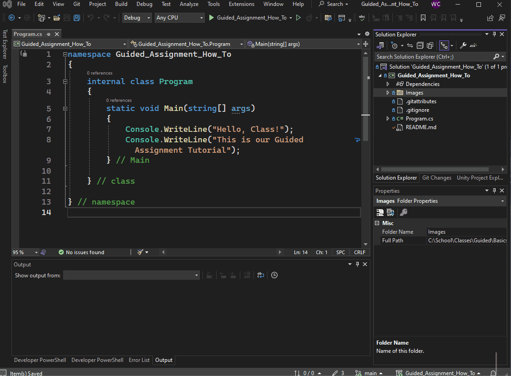

[Introduction](#intro) - [Requirements](#requirements) - [Step By Step](#step-by-step) - [Rubric](#rubric)

# Guided Assignment: Starter Project

---

## How to do a Guided Assignment

Guided assignments are a hands, step by step exercise to introduce new subjects.

This starter project will make sure you know how to read and work with the Guided Assignments.

Requirements
- Visual Studio 2022
- GitHub Account ( www.GitHub.com )

Video Walkthrough: https://youtu.be/EZYbTLSwnTw?si=6tcdBjULf2tclNMB

---

## Requirements

1. Setup your GitHub account so you can see the Guided Assignments
2. Click the link to go to the Guided Assignment online.
3. Download the project to your computer
4. Add the Extension so you can see the formatted README.md
5. Type your name in the submission textbox online and submit

---

## Step By Step

### 1. Setup your GitHub account so you can see the Guided Assignments

- If you already have a GitHub Account, skip to step 2.
- If you haven't already, sign up for a free GitHub account.
    - Use your **student.rtc.edu** email for free perks.
	- Goto www.github.com
    - Video: [Setting Up Your GitHub Account](https://www.youtube.com/watch?v=Gn3w1UvTx0A)
    	- How to Create a GitHub Account (2023) - Full Tutorial - SWIFTNESS

---

### 2. Click on the GitHub link to show the assignment

Click on the link in the assignment that will take you to the GitHub Repository.

### [Guided Assignment : How to do the Guided Assignments](https://github.com/WCramRTC/Guided_Assignment_How_To)

This should bring up the GitHub Repository with the assignment.

> **In future assignments, you can just read the instructions straight from GitHub if you would like.**

---
### Step 3. Click `Code` and open the project in Visual Studio.

1. Click the large green `Code` button in the upper corner of the repository.
2. Click the `Open with Visual Studio` option.
    - Depending on what programs you have installed different options may appear.
    - You should already have Visual Studio 2022 installed, so this option should appear.
3. Select the folder where you want to save this project, and click `Clone`.
4. The project should now open on your computer.
5. In the Solution Explorer to the right, click the little arrow next to the 2nd file, which will be the project name. This should show you all the files.

---

### Step 4. Add the Extension to properly view Markdown files

1. Click `Extensions` on the Visual Studio menu bar, then `Manage Extensions`
2. In the search box on the upper right corner, search for ***markdown***
3. Select and install **"Markdown v2"**.
4. Double click the **README.md** file in the Solution Explorer window, located on the right hand side.
    - If you don't see it you might need to select the *Solution Explorer* tab.

---

### Step 5. Paste DONE in the Assignment Submission Textbox on Canvas

1. On Canvas type your name in the submission box and hit submit.
    - In the future you will submit your repository links in the submission box.

---

## Assignment Rubric

| Step                | Description                                                         | Points |
|---------------------|---------------------------------------------------------------------|--------|
| Setup GitHub Account | Create and setup your GitHub account to access Guided Assignments.  | 40     |
| Access Guided Assignment | Click the provided link to go to the Guided Assignment online.      | 15     |
| Download Project    | Download the project to your local computer.                        | 15     |
| Add Extension       | Add the required extension to view the formatted README.md file.    | 15     |
| Submit Assignment   | Type your name in the submission textbox online and submit the assignment. | 15     |

