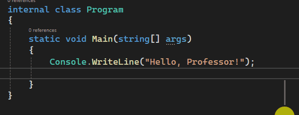
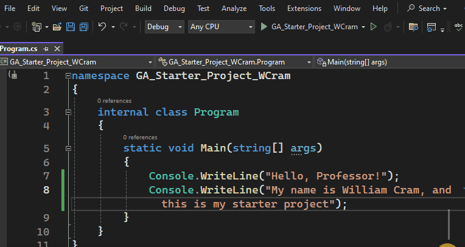

[Introduction](#intro) - [Requirements](#requirements) - [Step By Step](#step-by-step) - [Rubric](#rubric)

# Guided Assignment: Starter Project

---

<a id="intro"></a>

## How to do a Guided Assignment

Guided assignments are a hands, step by step exercise to introduce new subjects.

This starter project will make sure you are setup to complete the future guided assignments and submit them properly.

Requirements
- Visual Studio 2022
- GitHub Account ( www.GitHub.com )

---

<a id="requirements"></a>
## Requirements

1. Setup your GitHub account so you can see the Guided Assignments
2. Create a new project C# project
3. Follow the steps in the Guided Assignment to fulfill the requirements
4. Get your project uploaded ( pushed ) online to GitHub, with a public repository
5. Submit GitHub repository URL in the TextBox on canvas

---

<a id="step-by-step"></a>
## Step By Step

### 1. Setup your GitHub account so you can see the Guided Assignments

- If you already have a GitHub Account, skip to step 2.
- If you haven't already, sign up for a free GitHub account.
    - Use your **student.rtc.edu** email for free perks.
	- Goto www.github.com
    - [Setting Up Your GitHub Account](https://www.youtube.com/watch?v=Gn3w1UvTx0A)
	- How to Create a GitHub Account (2023) - Full Tutorial - 

---

### 2. Create a new Console Application in Visual Studio
1. Open Visual Studio 2022
2. Create a new Console Application
3. Give it the name ***GA\_Starter_Project\_YourName***   
Example: `GA_Start_Project_WCram`
4. In Frameworks, make sure to check the `Include Top-Level Statements` checkbox
5. Finish the setup.


---

### 3. Edit "Hello, World" to say "Hello, Professor"

1. Replace `Hello,World` with `Hello, Professor`

```csharp
	Console.WriteLine("Hello, World"); // Replace This
	Console.WriteLine("Hello, Professor"); // With this
```


---

### 4. Add another `Console.WriteLine()` and introduce yourself by display "My name is [Your Name], and this is my starter project".

```csharp
	// Example
	Console.WriteLine("Hello,Professor");
	Console.WriteLine("My name is William Cram, and this is my starter project");
```



---

### 5. Save and Run your code
1. Save your code by either 
- Clicking on the File Menu in the top left corner and clicking *Save All*, orhttp://browsing-file-host/Images/RunningCode.png
- Pressing `Ctrl + Shift + S`. This is the hotkey to save all.



2. Run your code by either
- Clicking the Green Arrow above your code, or
- Clicking **Debug** then **Start Debugging** , or
- Pressing **F5**

If it works you should see a console application appear with your text.


---

### 6. Create a Git Repository

1. Click **Git** then **Create Git Repository**
- A new window should open up
2. (First Time) Log into your GitHub account.
3. Uncheck **Make this repository Private**
4. Click **`Create and Push`** at the bottom of the window


---

### 7. Check to see that it was uploaded properly

1. In the GitChanges window to the right, click on the 3 dots in the upper right corner ( the menu button ), **`...`**.
2. Select **`Open in Browser`**. This should open up your GitHub account.
3. Click on the **`Program.cs`** file and make sure it shows your updated code.


    #### If your code did not update
    - Go back to visual studio. Inside of that Git Changes window, see if there is anything listed under *Changes*. If there are, type a message into the message box, like Update. Then hit commit all.
    - Click the **Git** menu and **Push**. This should update your code online. Look at your repository online and refresh the page. You should see your changes.

4. Finally make sure the tag next to your repository name says public.

    #### If it says private
    - Click on the Setting button in your repository.
	- Scroll to the very bottom of the General tab.
	- Click **`Change Visability`**
	- Follow the steps.

---

### 8. Copy your repository URL and submit it in the Canvas text box

1. Copy the Repository URL and paste it into the Canvas Submission Textbox

---

<a id="rubric"></a>
### Rubric